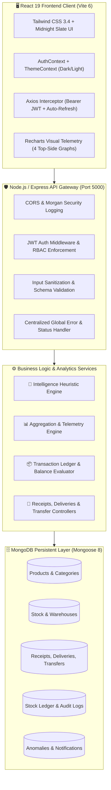
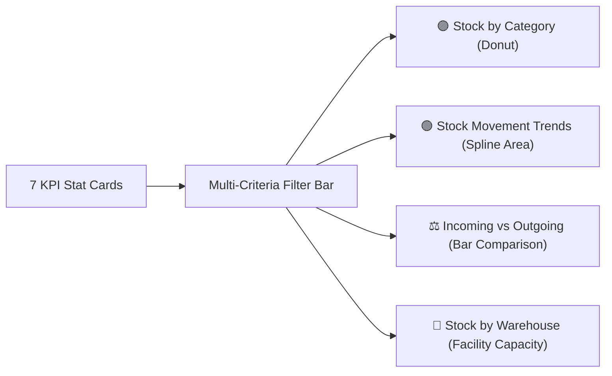
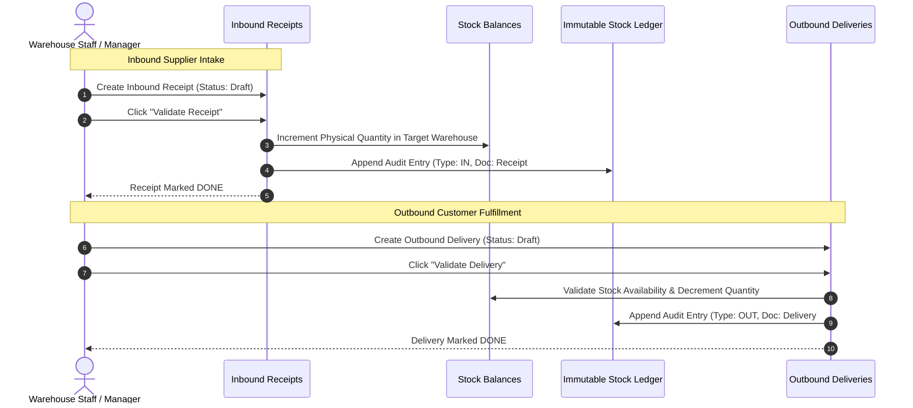

<p align="center">
  
</p>

<h1 align="center">StockSense — Intelligent Inventory OS</h1>

<p align="center">
  <strong>Enterprise-Grade Real-Time Inventory Operating System & Predictive Intelligence Platform</strong>
</p>

<p align="center">
  
  
  
  
  
  
  
  
</p>

---

## 📑 Table of Contents
1. [Executive Overview & Vision](#-executive-overview--vision)
2. [High-Level System Architecture](#-high-level-system-architecture)
3. [Top-Side Visual Analytics & Real-Time Telemetry](#-top-side-visual-analytics--real-time-telemetry)
4. [Proactive Inventory Intelligence Suite](#-proactive-inventory-intelligence-suite)
5. [Core Operations Lifecycle](#-core-operations-lifecycle)
6. [Complete Screen & Feature Catalog (21 Modules)](#-complete-screen--feature-catalog-21-modules)
7. [Comprehensive Database Schemas & Data Models](#-comprehensive-database-schemas--data-models)
8. [Complete REST API Reference](#-complete-rest-api-reference)
9. [Role-Based Access Control (RBAC) Matrix](#-role-based-access-control-rbac-matrix)
10. [Corporate Design & Midnight Slate Palette](#-corporate-design--midnight-slate-palette)
11. [Step-by-Step Installation & Quick Start Guide](#-step-by-step-installation--quick-start-guide)
12. [Automated Testing & Quality Assurance](#-automated-testing--quality-assurance)
13. [Troubleshooting & Frequently Asked Questions](#-troubleshooting--frequently-asked-questions)
14. [Git Branching Strategy & Workflow](#-git-branching-strategy--workflow)

---

## 📖 Executive Overview & Vision

Traditional inventory software functions merely as a digital ledger—passive database tables recording receipts, issues, and counts after physical movements occur.

**StockSense** elevates warehouse and supply chain management into a **predictive decision cockpit**. By synthesizing real-time transaction velocities, historical consumption patterns, and multi-facility capacity metrics, StockSense answers three fundamental operational questions every morning:
1. **"What requires my immediate attention today?"** (*Daily Action Center*)
2. **"Which items will stock out next and when?"** (*Predictive Runout Forecasting*)
3. **"Where are hidden irregularities, shrinkage, or ghost inventory?"** (*Autonomous Anomaly Detection*)

StockSense unifies purchasing, warehouse transfers, fulfillment picking, cycle counting, QR scanning, and PDF compliance statements into one cohesive MERN ecosystem.

---

## 🏛️ High-Level System Architecture

StockSense follows a clean, decoupled, layered architecture designed for scalability, zero-downtime modular additions, and strict enterprise security:



---

## 📊 Top-Side Visual Analytics & Real-Time Telemetry

The command dashboard features a specialized visual telemetry grid positioned at the **very top of the screen** directly below the headline KPI cards, providing immediate operational awareness before drilling down into granular queues:



### 1. 🟣 Stock by Category (*Donut / Pie Breakdown*)
* **Component**: `StockByCategoryChart.jsx`
* **Visualization**: Interactive SVG Donut chart featuring customizable hover tooltips, center cutout, and radial segment breakdown.
* **Metrics Rendered**: Total unit volumes allocated per category (e.g. *Raw Materials, Electrical Components, Industrial Supplies, Commercial Furniture*).
* **Interactivity**: Legend toggling, segment hover elevation, and responsive auto-scaling.

### 2. 🟢 Stock Movement Trends (*Dual-Gradient Timeline Activity*)
* **Component**: `StockMovementChart.jsx`
* **Visualization**: Multi-axis spline area graph with dual smooth gradients (`#10B981` Inbound vs `#EC4899` Outbound).
* **Metrics Rendered**: Hourly and daily volume flow of units entering the facility via receipts vs exiting via customer shipments.
* **Telemetry Value**: Pinpoints peak operational congestion times and warehouse throughput surges.

### 3. ⚖️ Incoming vs Outgoing (*Fulfillment Balance*)
* **Component**: `IncomingVsOutgoingChart.jsx`
* **Visualization**: Dual-column bar graph comparing inbound supplier receipts against outbound delivery shipments.
* **Metrics Rendered**: Open/Pending operations workload balance compared directly against completed movement counts.
* **Telemetry Value**: Prevents operational bottlenecks by signaling if shipping teams are outpacing receiving docks or vice versa.

### 4. 🏢 Stock by Warehouse (*Facility Capacity Distribution*)
* **Component**: `StockByWarehouseChart.jsx`
* **Visualization**: Horizontal bar chart with 130px label clearance and dynamic color coding per facility.
* **Metrics Rendered**: Total on-hand physical inventory distributed across regional depots (*Central Distribution Hub, South Logistics Facility, West Coast Depot*).
* **Telemetry Value**: Identifies facility over-utilization and regional inventory imbalances.

### 5. 🎛️ Multi-Criteria Real-Time Slicing Bar
* **Component**: `DashboardFilters.jsx`
* **Criteria**:
  1. **Category**: Slices all KPIs and charts by specific product category.
  2. **Warehouse**: Isolates inventory telemetry to a designated physical facility.
  3. **Operation Type**: Toggles between Receipts, Deliveries, Transfers, and Adjustments.
  4. **Status**: Filters by `Draft`, `Pending`, `Done`, or `Cancelled`.
* **Behavior**: Instant client-side state reactivity with 1-click filter reset.

---

## 🧠 Proactive Inventory Intelligence Suite

StockSense embeds seven proprietary heuristic algorithms that transform raw transaction logs into autonomous intelligence:

### 1. Daily Action Center — *"What Should I Do Today?"*
* **Endpoint**: `GET /api/intelligence/daily-actions`
* **Purpose**: Synthesizes open tasks into a single morning action queue with visual urgency badges.
* **Queue Tiers**:
  * 🔴 **Out of Stock**: Products with 0 units remaining and pending orders.
  * 🟠 **Reorder Needed**: Products at or below configured reorder levels.
  * 🔵 **Pending Deliveries**: Open customer orders waiting for picking and dispatch.
  * 🟢 **Scheduled Receipts**: Inbound supplier deliveries arriving today.
* **Actionable Cards**: Each task includes a 1-click action button (*"Reorder 50 units"*, *"Review Stock"*, *"Process Delivery #DEL-102"*, *"Validate Transfer #TR-44"*).

### 2. Predictive Stock Forecast & Depletion Curves
* **Endpoint**: `GET /api/intelligence/forecasts`
* **Formula**:
  $$\text{Average Daily Usage} = \frac{\sum_{t=1}^{14} \text{Daily Outbound Volume}}{14}$$
  $$\text{Projected Days Left} = \frac{\text{Current Available Stock}}{\text{Average Daily Usage}}$$
* **Classification Thresholds**:
  * **CRITICAL** (🔴): $\text{Days Left} \le 3$ or stock $= 0$ (*Immediate stockout alert*).
  * **HIGH** (🟠): $3 < \text{Days Left} \le 7$ (*Order required in current purchasing cycle*).
  * **MODERATE** (🟡): $7 < \text{Days Left} \le 14$ (*Stable buffer, monitor lead times*).
  * **SAFE** (🟢): $\text{Days Left} > 14$ (*Healthy coverage*).

### 3. Inventory Risk Radar
* **Endpoint**: `GET /api/intelligence/risk-radar`
* **Purpose**: Evaluates multidimensional supply chain vulnerabilities across:
  * **Depletion Velocity**: Rapid acceleration in consumption rates compared to historical averages.
  * **Single-Point Facility Bottlenecks**: High-demand SKUs concentrated entirely in a single warehouse.
  * **Supplier Lead Time Delays**: Exposure to stockouts due to delayed replenishment shipments.

### 4. Autonomous Anomaly Detection Engine
* **Endpoint**: `GET /api/intelligence/anomalies`
* **Schema**: `server/models/Anomaly.js`
* **Detection Algorithms**:
  * **Unexpected Consumption Spikes**: Daily usage exceeding $300\%$ of the 14-day moving average.
  * **Unexplained Shrinkage**: Physical inventory adjustment discrepancy exceeding $-15\%$.
  * **Dead / Dormant Stock**: Zero movement for $\ge 60$ days while holding high capital value.
  * **Ghost Inventory**: Inventory recorded in system but failing pick validations.
* **Resolution Workflow**: Each anomaly includes an investigation log and `PUT /api/intelligence/anomalies/:id/resolve` action with audit tracking.

### 5. Interactive "What-If" Inventory Simulator
* **Endpoint**: `POST /api/intelligence/simulate`
* **Interactive Parameters**:
  * **Demand Surge Multiplier**: Simulate $+10\%$ to $+200\%$ sudden sales spikes.
  * **Supplier Lead Time Delay**: Model vendor delays from $+1$ to $+30$ days.
  * **Emergency Replenishment**: Test incoming emergency purchase orders.
* **Output Metrics**:
  * Simulated daily consumption rate.
  * New projected stockout date and days of inventory remaining.
  * Safety buffer status: `STOCKOUT IMPENDING`, `VULNERABLE BUFFER`, or `RESILIENT BUFFER`.

### 6. "Where is My Stock?" Instant Locator
* **Endpoint**: `GET /api/intelligence/find-stock?q=<query>`
* **Natural Language Parsing**: Tokenizes queries to match SKUs, product names, warehouse codes, bin coordinates, and aisle tags simultaneously.
* **Returned Intelligence**: Total system stock, per-facility allocation, exact bin/rack location, and reserved vs available quantity breakdown.

### 7. Smart Reorder & Circular Health Gauge
* **Formula for Inventory Health**:
  $$\text{Health Score} = \max\left(0, \min\left(100, \text{round}\left(\frac{H \times 100 + R \times 50}{T}\right) - P_{\text{anomalies}}\right)\right)$$
  *(where $T$ = Total SKUs, $H$ = Healthy SKUs, $R$ = Low/Reorder SKUs, and $P$ = Critical Anomaly Penalties)*.
* **Visualization**: 360-degree SVG circular progress ring with healthy, low-stock, and out-of-stock breakdowns.

---

## 🔄 Core Operations Lifecycle

StockSense enforces strict, auditable multi-step workflows for every physical inventory movement:



### Operational Rules & Safety Guards
1. **Zero Negative Stock Policy**: Outbound deliveries and negative adjustments are mathematically blocked if quantity exceeds current available stock.
2. **Circular Transfer Prevention**: Internal transfers are validated to ensure origin and destination warehouses are strictly distinct.
3. **Immutable Ledger Entries**: Every inventory movement generates an uneditable `StockLedger` record containing transaction type, previous balance, new balance, user ID, and timestamp.
4. **Physical Adjustment Variances**: Adjustments automatically calculate difference ($\Delta = \text{Physical Count} - \text{Recorded Stock}$) and apply compensatory ledger entries.

---

## 🖥️ Complete Screen & Feature Catalog (21 Modules)

| # | Screen / Module | Route Path | Access Role | Primary Purpose & Key Features |
|---|:---|:---|:---|:---|
| 1 | **Dashboard** | `/dashboard` | All | Command center with 7 KPIs, 4 top-side graphs, filters, Daily Action Center, Forecast, Risk Radar, and live activity. |
| 2 | **Products Catalog** | `/products` | All | Master product database with SKU search, barcode generation, reorder levels, category mapping, and stock status. |
| 3 | **Categories** | `/categories` | Manager | Product category taxonomy, hierarchical codes, and associated item count analytics. |
| 4 | **Warehouse Facilities** | `/warehouse` | All | Facility management, capacity utilization, address, contact person, and multi-depot stock summaries. |
| 5 | **Stock Levels** | `/stock` | All | Live inventory grid mapping every SKU across each physical warehouse with stock status indicators. |
| 6 | **Inbound Receipts** | `/receipts` | All | Supplier purchase receipts, line-item entry, PDF packing slips, and `Draft` $\to$ `Done` validation. |
| 7 | **Outbound Deliveries** | `/deliveries` | All | Customer sales fulfillment, picking lists, delivery notes, and stock deduction workflows. |
| 8 | **Internal Transfers** | `/transfers` | All | Multi-warehouse inventory relocation with dispatch, in-transit status, and receiving facility intake. |
| 9 | **Stock Adjustments** | `/adjustments` | Manager | Physical audit reconciliation, cycle count entry, automatic variance calculation, and ledger posting. |
| 10 | **Stock Ledger** | `/move-history` | All | Immutable, chronological audit ledger tracking every unit in/out with balance history and user attribution. |
| 11 | **Barcode Scanner** | `/scanner` | All | Camera-based QR/Barcode reader, manual SKU input, mock scan triggers, and instant product detail lookup. |
| 12 | **Stock Forecast** | `/forecast` | All | Dedicated runout analytics workbench, burn-rate predictions, days of inventory countdown, and restock urgencies. |
| 13 | **Risk Radar** | `/risk-radar` | All | Interactive supply chain vulnerability matrix monitoring single-facility dependencies and fulfillment risks. |
| 14 | **Anomalies Log** | `/anomalies` | Manager | Autonomous detection feed tracking volume spikes, shrinkage, dead stock, and resolution logs. |
| 15 | **What-If Simulator** | `/simulator` | Manager | Interactive sandbox modeling demand surges ($+10\%$ to $+200\%$) and vendor delays on inventory buffer days. |
| 16 | **Analytics Hub** | `/analytics` | All | Comprehensive operational charts, monthly movement volumes, category distributions, and warehouse turnover. |
| 17 | **Official Reports** | `/reports` | All | 7 exportable module statements with printable corporate headers, instant print-to-PDF, and CSV export. |
| 18 | **Audit Logs** | `/audit-logs` | Manager | System-wide security audit trail tracking user logins, status modifications, deletions, and IP addresses. |
| 19 | **User Profile** | `/profile` | All | Personal profile viewer, email update, password change form, and active session status. |
| 20 | **System Settings** | `/settings` | Manager | Global application preferences, low-stock threshold default, alert notification toggles, and facility parameters. |
| 21 | **Authentication Portal** | `/login`, `/signup`, `/forgot-password`, `/reset-password` | Public | Secure JWT login, registration with role selection, and password recovery workflows. |

---

## 🗄️ Comprehensive Database Schemas & Data Models

StockSense is backed by 11 production-grade Mongoose models located in `server/models/`:

```
server/models/
├── User.js              # Authentication, bcrypt passwords, RBAC roles
├── Warehouse.js         # Multi-facility locations, codes, contact persons
├── Category.js          # Product classifications and taxonomy
├── Product.js           # SKUs, barcode numbers, descriptions, pricing, reorder levels
├── Stock.js             # Current on-hand quantity per Product × Warehouse
├── Receipt.js           # Inbound supplier documents & line items
├── Delivery.js          # Outbound customer documents & line items
├── InternalTransfer.js  # Inter-warehouse movement tracking
├── StockAdjustment.js   # Physical cycle counts, audited differences & reasons
├── StockLedger.js       # Permanent, append-only transaction audit trail
├── Anomaly.js           # Heuristic alerts (spikes, shrinkage, dead stock)
├── AuditLog.js          # System user activity and security logs
└── Notification.js      # Real-time alert notifications
```

### Schema Field Specification Table

| Model | Key Fields | Indexes & Constraints | Relationships |
| :--- | :--- | :--- | :--- |
| **`User`** | `name`, `email`, `password`, `role`, `status`, `lastLogin` | Unique: `email` | Linked to Ledger, Adjustments, and AuditLogs |
| **`Warehouse`** | `name`, `code`, `location`, `city`, `state`, `contactPerson`, `capacity` | Unique: `code` | Referenced by Stock, Receipts, Deliveries, Transfers |
| **`Category`** | `name`, `code`, `description` | Unique: `code`, `name` | Referenced by Product |
| **`Product`** | `name`, `sku`, `category`, `unitOfMeasure`, `price`, `cost`, `reorderLevel`, `barcode` | Unique: `sku`, `barcode` | Category (Ref), Stock (1:Many) |
| **`Stock`** | `product`, `warehouse`, `quantity`, `minQuantity`, `maxQuantity` | Compound Unique: `{ product: 1, warehouse: 1 }` | Product (Ref), Warehouse (Ref) |
| **`Receipt`** | `receiptNumber`, `supplier`, `warehouse`, `items: [{ product, quantity, unitPrice }]`, `status` | Unique: `receiptNumber` | Warehouse (Ref), Product (Ref) |
| **`Delivery`** | `deliveryNumber`, `customer`, `warehouse`, `items: [{ product, quantity }]`, `status` | Unique: `deliveryNumber` | Warehouse (Ref), Product (Ref) |
| **`InternalTransfer`**| `transferNumber`, `fromWarehouse`, `toWarehouse`, `items: [{ product, quantity }]`, `status` | Unique: `transferNumber` | Warehouses (Refs), Product (Ref) |
| **`StockAdjustment`**  | `adjustmentNumber`, `warehouse`, `product`, `recordedQuantity`, `physicalQuantity`, `difference`, `reason`, `status` | Unique: `adjustmentNumber` | Warehouse (Ref), Product (Ref) |
| **`StockLedger`** | `product`, `warehouse`, `transactionType`, `documentNumber`, `quantityChange`, `balanceAfter`, `user` | Index: `{ product: 1, createdAt: -1 }` | Product, Warehouse, User (Refs) |
| **`Anomaly`** | `type`, `severity`, `title`, `description`, `product`, `warehouse`, `isResolved`, `resolvedBy` | Index: `{ severity: 1, isResolved: 1 }` | Product, Warehouse, User (Refs) |

---

## 📡 Complete REST API Reference

All API routes are served under `/api` and return standardized JSON payloads:
```json
{
  "success": true,
  "message": "Human readable status description",
  "data": { ... }
}
```

### 1. Authentication & Users
| Method | Endpoint | Access | Description |
| :--- | :--- | :--- | :--- |
| `POST` | `/api/auth/register` | Public | Create new user account with role |
| `POST` | `/api/auth/login` | Public | Authenticate credentials and issue JWT |
| `GET` | `/api/auth/me` | Authenticated | Retrieve current authenticated user session |
| `POST` | `/api/auth/logout` | Authenticated | Terminate session and clear tokens |
| `POST` | `/api/auth/forgot-password` | Public | Initiate password reset verification |
| `POST` | `/api/auth/reset-password` | Public | Finalize password reset with token |
| `GET` | `/api/users/profile` | Authenticated | Get detailed user profile |
| `PUT` | `/api/users/profile` | Authenticated | Update user name and profile information |
| `PUT` | `/api/users/change-password` | Authenticated | Update account password |

### 2. Products, Categories & Warehouses
| Method | Endpoint | Access | Description |
| :--- | :--- | :--- | :--- |
| `GET` | `/api/products` | Authenticated | List all products with search, pagination, category filter |
| `POST` | `/api/products` | Manager | Create new product SKU |
| `GET` | `/api/products/:id` | Authenticated | Retrieve single product details |
| `PUT` | `/api/products/:id` | Manager | Update product attributes |
| `DELETE` | `/api/products/:id` | Manager | Remove product from catalog |
| `GET` | `/api/categories` | Authenticated | List all product categories |
| `POST` | `/api/categories` | Manager | Create new category |
| `PUT` | `/api/categories/:id` | Manager | Update category details |
| `DELETE` | `/api/categories/:id` | Manager | Delete category |
| `GET` | `/api/warehouses` | Authenticated | List all regional warehouse facilities |
| `POST` | `/api/warehouses` | Manager | Create new warehouse facility |
| `GET` | `/api/warehouses/:id` | Authenticated | Get warehouse details and stored stock summary |
| `PUT` | `/api/warehouses/:id` | Manager | Update warehouse details |
| `DELETE` | `/api/warehouses/:id` | Manager | Delete warehouse |

### 3. Stock & Inventory Ledger
| Method | Endpoint | Access | Description |
| :--- | :--- | :--- | :--- |
| `GET` | `/api/stock` | Authenticated | Get global stock inventory across all facilities |
| `GET` | `/api/stock/product/:productId`| Authenticated | Get stock distribution for a specific product |
| `GET` | `/api/stock/warehouse/:warehouseId`| Authenticated | Get all items stored in a specific facility |
| `GET` | `/api/stock/low-stock` | Authenticated | Filter products currently at or below reorder level |
| `GET` | `/api/ledger` | Authenticated | Retrieve immutable stock movement audit records |
| `GET` | `/api/ledger/product/:productId` | Authenticated | Retrieve audit history for a single SKU |

### 4. Operations (Receipts, Deliveries, Transfers, Adjustments)
| Method | Endpoint | Access | Description |
| :--- | :--- | :--- | :--- |
| `GET` | `/api/receipts` | Authenticated | List inbound receipts |
| `POST` | `/api/receipts` | Authenticated | Create draft supplier receipt |
| `GET` | `/api/receipts/:id` | Authenticated | Get receipt details and line items |
| `POST` | `/api/receipts/:id/validate` | Authenticated | Validate receipt $\to$ increment stock and log ledger |
| `GET` | `/api/deliveries` | Authenticated | List outbound customer deliveries |
| `POST` | `/api/deliveries` | Authenticated | Create draft customer delivery |
| `GET` | `/api/deliveries/:id` | Authenticated | Get delivery details |
| `POST` | `/api/deliveries/:id/validate` | Authenticated | Validate delivery $\to$ decrement stock and log ledger |
| `GET` | `/api/transfers` | Authenticated | List inter-warehouse transfers |
| `POST` | `/api/transfers` | Authenticated | Initiate transfer between two warehouses |
| `GET` | `/api/transfers/:id` | Authenticated | Get transfer status and line items |
| `POST` | `/api/transfers/:id/validate` | Authenticated | Complete transfer $\to$ update origin & target facilities |
| `GET` | `/api/adjustments` | Authenticated | List physical count adjustments |
| `POST` | `/api/adjustments` | Manager | Record physical cycle count difference |
| `GET` | `/api/adjustments/:id` | Authenticated | Get adjustment details |
| `POST` | `/api/adjustments/:id/apply` | Manager | Apply adjustment $\to$ reconcile stock balance |

### 5. StockSense Intelligence Platform
| Method | Endpoint | Access | Description |
| :--- | :--- | :--- | :--- |
| `GET` | `/api/intelligence/daily-actions`| Authenticated | Fetch prioritized daily operational action queue |
| `GET` | `/api/intelligence/forecasts` | Authenticated | Get predictive runout dates and days of inventory |
| `GET` | `/api/intelligence/forecasts/:id`| Authenticated | Get single SKU depletion curve |
| `GET` | `/api/intelligence/risk-radar` | Authenticated | Fetch supply chain vulnerability metrics |
| `GET` | `/api/intelligence/anomalies` | Authenticated | List active anomalies (spikes, shrinkage, dead stock) |
| `PUT` | `/api/intelligence/anomalies/:id/resolve`| Manager | Resolve an anomaly with audit note |
| `POST` | `/api/intelligence/simulate` | Authenticated | Run What-If simulation with demand/lead-time changes |
| `GET` | `/api/intelligence/find-stock` | Authenticated | Natural language locator across warehouse bins |
| `GET` | `/api/intelligence/explain/:id`| Authenticated | Generate heuristic breakdown explaining stock level |
| `GET` | `/api/dashboard/summary` | Authenticated | Fetch 7 KPIs, movement activity, and health score |
| `GET` | `/api/dashboard/search` | Authenticated | Global instant search across SKUs, receipts, orders |
| `GET` | `/api/dashboard/stock-by-warehouse`| Authenticated | Aggregated warehouse capacity breakdown for charts |
| `GET` | `/api/dashboard/reorder-recommendations`| Authenticated| Rule-based EOQ replenishment suggestions |

---

## 🛡️ Role-Based Access Control (RBAC) Matrix

| System Action / Feature | Inventory Manager | Warehouse Staff |
| :--- | :---: | :---: |
| **View Dashboard, KPIs & Top-Side Graphs** | ✅ Full Access | ✅ Full Access |
| **View Products & Warehouse Catalog** | ✅ Full Access | ✅ View Only |
| **Create / Edit / Delete Products & Warehouses** | ✅ Permitted | ❌ Blocked |
| **Create Inbound Receipts & Outbound Deliveries** | ✅ Permitted | ✅ Permitted |
| **Validate Inbound Receipts & Deduct Deliveries** | ✅ Permitted | ✅ Permitted |
| **Initiate & Receive Inter-Warehouse Transfers** | ✅ Permitted | ✅ Permitted |
| **Conduct Physical Adjustments & Apply Variances**| ✅ Permitted | ❌ Manager Only |
| **Access Daily Action Center & Risk Radar** | ✅ Full Access | ✅ Full Access |
| **Execute "What-If" Inventory Simulator** | ✅ Full Access | ❌ Manager Only |
| **Resolve & Dismiss System Anomalies** | ✅ Permitted | ❌ Manager Only |
| **View System Audit Logs** | ✅ Full Access | ❌ Manager Only |
| **Export Official PDF Statements & CSVs** | ✅ Permitted | ✅ Permitted |
| **Use Camera Barcode & QR Scanner** | ✅ Permitted | ✅ Permitted |

---

## 🎨 Corporate Design & Midnight Slate Palette

StockSense utilizes an executive **Midnight Slate & Platinum Silver** aesthetic crafted to match its flight bird brand emblem:

* **Primary Dark Accent**: `#1b2839` / `#151f2d` / `#0f1722` (Deep midnight slate navy symbolizing corporate stability).
* **Card & Panel Backgrounds**: Soft platinum gray `#f4f6f8` and `#cecfd2` (matching the logo card container).
* **Semantic Status Indicators**:
  * 🟢 **Success / Healthy / In Stock**: Emerald `#10B981`
  * 🟠 **Warning / Reorder Approaching**: Amber `#F59E0B`
  * 🔴 **Critical / Out of Stock / Danger**: Rose `#EF4444`
  * 🟣 **Fulfillment / In Transit / Purple**: Indigo `#6366F1`
* **Theme Switching**: Built-in support for Dark and Light mode toggled via the header navigation and persisted in `localStorage`.

---

## 🚀 Step-by-Step Installation & Quick Start Guide

### 1. Prerequisites
Ensure the following are installed on your host system:
* **Node.js**: v18.0.0 or higher ([Download](https://nodejs.org/))
* **npm**: v9.0.0 or higher
* **MongoDB**: A running local MongoDB instance on port `27017` or a MongoDB Atlas URI

### 2. Clone the Repository
```bash
git clone https://github.com/abhishekkushare17/StockSense.git
cd StockSense
```

### 3. Environment Setup
Create a `.env` file in the `server/` directory:
```ini
# server/.env
PORT=5000
NODE_ENV=development
MONGO_URI=mongodb://localhost:27017/stocksense
JWT_SECRET=stocksense_super_secure_jwt_secret_key_2026
JWT_EXPIRES_IN=7d
CLIENT_URL=http://localhost:3000
```

### 4. Install Dependencies
Install dependencies concurrently across the root orchestrator, frontend client, and backend server:
```bash
npm run install:all
```

### 5. Seed Initial Database
Populate the database with pre-configured warehouses, categories, SKUs, initial stock, transaction movements, and seed accounts:
```bash
npm run seed
```

#### Pre-Configured Seed Credentials:
| Account Role | Email Address | Password |
| :--- | :--- | :--- |
| **Inventory Manager** | `manager@stocksense.com` | `Password123!` |
| **Warehouse Staff** | `staff@stocksense.com` | `Password123!` |

### 6. Launch Development Environment
Start both backend API server and frontend Vite development server concurrently:
```bash
npm run dev
```

* 🖥️ **Frontend Client**: [http://localhost:3000](http://localhost:3000)
* ⚙️ **Backend API**: [http://localhost:5000](http://localhost:5000)
* 🩺 **Health Check**: [http://localhost:5000/api/health](http://localhost:5000/api/health)

---

## 🧪 Automated Testing & Quality Assurance

StockSense uses Node.js native test runner (`node --test`) to run 21 end-to-end integration and unit tests without external runtime bloat:

```bash
npm run test:server
```

### Test Suite Execution Output (21 Passing Tests):
```text
TAP version 13
ok 1 - Intelligence Platform - Anomaly Model validates required schema fields
ok 2 - Intelligence Platform - Stock Forecast risk classification aligns with specs
ok 3 - Intelligence Platform - What-If Simulator calculates projected stock and coverage days accurately
ok 4 - Intelligence Platform - Location parser strips query punctuation and extracts keywords
ok 5 - API Standard - Health endpoint returns success structure
ok 6 - API Standard - 404 handler returns standardized error payload
ok 7 - Validation Middleware - Register requires valid email and password
ok 8 - Validation Middleware - Login requires email and password
ok 9 - Auth Middleware - Accessing protected route without token returns 401
ok 10 - Auth Middleware - Accessing protected route with invalid token returns 401
ok 11 - Database Foundation - All 10 models instantiate with valid schema validation
ok 12 - Receipt Operations - Input validation prevents missing warehouse and empty items
ok 13 - Delivery Operations - Input validation prevents missing warehouse and zero items
ok 14 - Internal Transfer - Prevents transferring to the exact same warehouse facility
ok 15 - Stock Adjustment - Model accurately computes difference between physical and recorded counts
ok 16 - Stock Ledger - Model enforces non-negative balance and validates audit fields
ok 17 - Operations Architecture - System includes all 5 lifecycle statuses and 5 transaction types
ok 18 - Product Management - Validation prevents empty name or duplicate SKU
ok 19 - Category Management - Validation prevents duplicate code and empty name
ok 20 - Warehouse Management - Validation prevents empty name and code
ok 21 - Reorder Rules - Low stock logic accurately compares currentStock with reorderLevel

# tests 21 | pass 21 | fail 0 | cancelled 0
```

---

## ❓ Troubleshooting & Frequently Asked Questions

### 1. Port Conflict (`EADDRINUSE: port 5000` or `port 3000`)
* **Cause**: Another instance of Node.js or Vite is already running.
* **Resolution**:
  ```powershell
  # On Windows PowerShell
  Get-Process -Name node | Stop-Process -Force
  ```
  Or change `PORT=5001` in `server/.env` and update the proxy in `client/vite.config.js`.

### 2. MongoDB Connection Failure (`ECONNREFUSED 127.0.0.1:27017`)
* **Cause**: Local MongoDB service is not started.
* **Resolution**: Start the MongoDB service via Windows Services (`services.msc`) or use a cloud MongoDB Atlas URI in `server/.env`:
  ```ini
  MONGO_URI=mongodb+srv://<username>:<password>@cluster.mongodb.net/stocksense?retryWrites=true&w=majority
  ```

### 3. Barcode Scanner Camera Access
* **Note**: Modern browsers require an `HTTPS` connection or `localhost` to grant camera permissions for the HTML5 video scanner. Use the built-in "Simulate Barcode" test buttons if testing in environments without physical camera hardware.

---

## 🌿 Git Branching Strategy & Workflow

StockSense follows strict feature-driven Git workflows to maintain production stability:

```
main (Production Release)
  ▲
  │ (Pull Request / Merge)
develop (Staging & Integration)
  ▲
  │ (Feature Branch)
feature/<module-name>
```

### Standard Feature Development Steps:
```bash
# 1. Switch to develop and pull latest upstream
git checkout develop
git pull origin develop

# 2. Create feature branch
git checkout -b feature/your-feature-name

# 3. Implement code & verify tests
npm test --prefix server
npm run build --prefix client

# 4. Commit and push
git add .
git commit -m "feat(scope): concise description of changes"
git push -u origin feature/your-feature-name

# 5. Merge into develop and main
git checkout develop
git merge feature/your-feature-name
git push origin develop

git checkout main
git merge develop
git push origin main

# 6. Return to develop
git checkout develop
```

---

## 📄 License & Attribution

This project is licensed under the **MIT License** — see the [LICENSE](LICENSE) file for complete details.

<p align="center">
  <sub>Developed with precision for <strong>StockSense</strong> &bull; Intelligent Inventory OS</sub>
</p>
